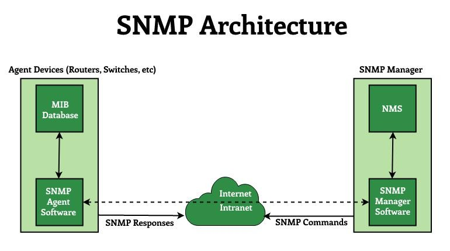
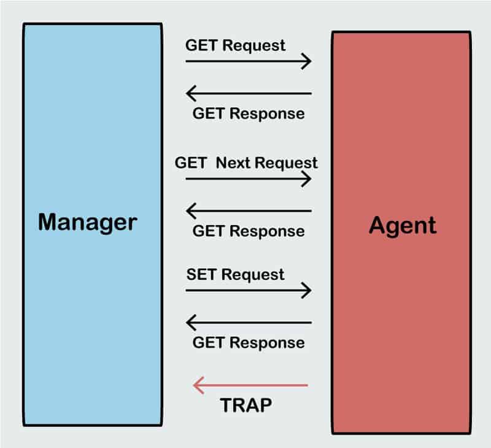

# PRTG Network Monitoring System

## Introduction
PRTG (Paessler Router Traffic Grapher) is a comprehensive network monitoring solution that helps administrators monitor network performance, detect issues, and ensure overall network health. It supports various monitoring protocols and technologies such as SNMP, NetFlow, and WMI.

## Key Concepts

###  **SNMP (Simple Network Management Protocol)**
SNMP is a widely used protocol for network management. It enables monitoring of network devices, collecting performance data, and sending alerts. PRTG uses SNMP to retrieve information from routers, switches, firewalls, and other SNMP-enabled devices.

####  **Ports**
Network monitoring relies on different ports for communication. Some commonly used ports in PRTG include:
- **161/162 (UDP)**: Used for SNMP queries and SNMP traps.
- **443 (TCP)**: Used for web-based access to the PRTG dashboard.
- **80 (TCP)**: Alternative port for HTTP-based access.
- **8080/8443 (TCP)**: Commonly used for additional services or remote probes.

####  **Agents**
Agents are software components that collect and transmit monitoring data from devices to the PRTG server. PRTG can operate with or without agents, depending on the monitoring method (e.g., SNMP, WMI, SSH, or NetFlow).

#### **NMS (Network Management System)**
A Network Management System (NMS) is a platform that provides real-time monitoring, analysis, and reporting of network performance. PRTG serves as an NMS by offering a centralized interface for managing network devices, servers, and applications.

#### **Manager**
The manager (or monitoring server) in PRTG is responsible for:
- Collecting data from monitored devices.
- Analyzing performance trends.
- Generating alerts and notifications.
- Providing visual dashboards for network administrators.

###  **Messages (SNMP Operations)**
PRTG utilizes SNMP messages for communication with network devices. The key SNMP operations include:
- **GET**: Retrieves a specific value from a managed device.
- **GETNEXT**: Requests the next value in a sequence from a managed device.
- **SET**: Modifies a value on a managed device.
- **TRAP**: An unsolicited message sent from a device to notify the manager of an event.
- **INFORM**: Similar to a trap but requires an acknowledgment from the SNMP manager.

  

## Conclusion
PRTG is a powerful tool for monitoring network infrastructure, ensuring optimal performance, and detecting potential failures before they escalate. Understanding key concepts such as SNMP, ports, agents, and alerts is essential for effective network monitoring.

---

For more information, visit the [PRTG Documentation](https://www.paessler.com/manuals/prtg).
